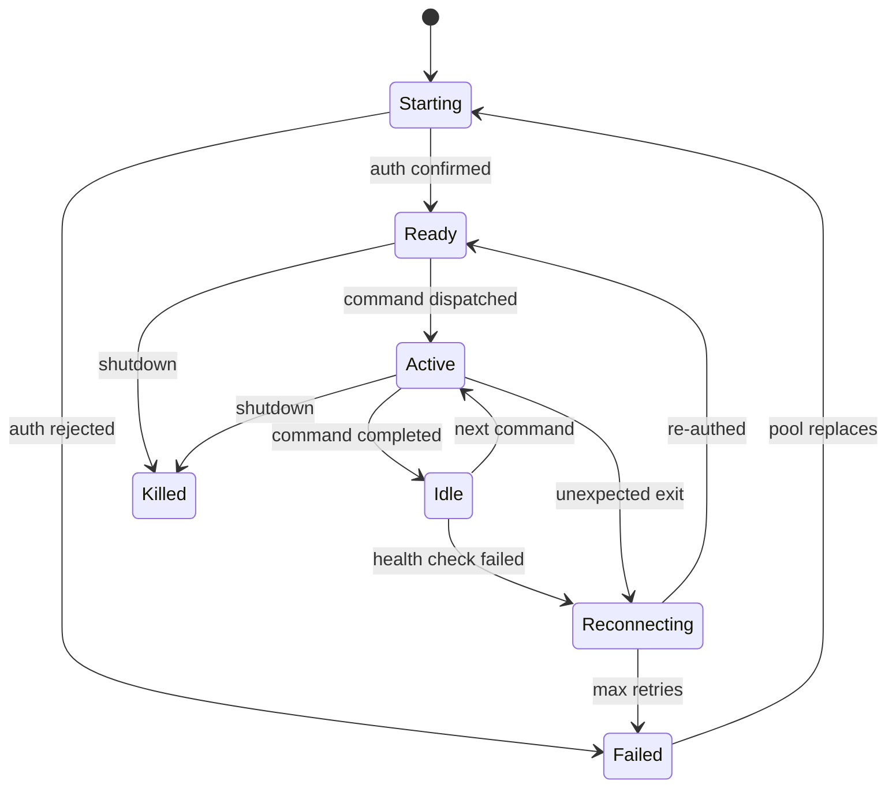

# Session Manager

## Goal / Objective

Provide reliable, observable management of Claude Code sessions running in tmux. The session manager is the foundation — every ACP call routes through a live session, so sessions must stay alive, authenticate correctly, and be replaceable without operator intervention.

## Scope

- Claude Code session detection (subscription OAuth vs API key)
- Session lifecycle state machine (start → ready → active → idle → reconnect → killed)
- Concurrent session pool with configurable minimum size
- Auto-reconnect on crash, auth expiry, or tmux socket loss
- Health checks and session status reporting
- Integration with existing `ClaudeACPHarness` class

## Architecture Overview

Sessions run as tmux panes. The manager tracks each session's state, authentication method, and last-activity timestamp. A background health-check loop runs every N seconds. Failed sessions are replaced from the pool. The pool maintains a configurable minimum of live sessions.

## Child Specs

- [SPEC-001](../../spec/Active/(SPEC-001)-Claude-Session-Lifecycle/(SPEC-001)-Claude-Session-Lifecycle.md) — Claude Session Lifecycle
- [SPEC-004](../../spec/Active/(SPEC-004)-Session-Pool-Manager/(SPEC-004)-Session-Pool-Manager.md) — Session Pool Manager

## Lifecycle

| Phase | Date | Commit | Notes |
|-------|------|--------|-------|
| Active | 2026-04-19 | -- | Initial creation |