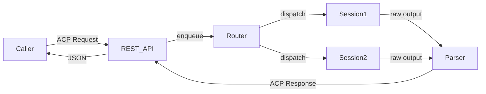

# ACP Protocol Layer

## Goal / Objective

Define and implement the ACP (Agent Communication Protocol) that structures interactions between callers and Claude Code sessions. Callers send structured JSON requests; the harness routes them to sessions, captures output, and returns structured JSON responses. This is the "programmable" layer that distinguishes the harness from raw `claude -p` piping.

## Scope

- ACP message format (request/response schema)
- Command router: queue, dispatch, timeout, retry
- Output parser: extract structured fields from Claude Code freeform text
- REST API: localhost HTTP server exposing ACP endpoints
- Provider abstraction: same ACP interface regardless of backend (Claude, Gemini, ChatGPT)

## Architecture Overview

## Child Specs

- [SPEC-002](../../spec/Active/(SPEC-002)-SCP-Protocol-Server/(SPEC-002)-SCP-Protocol-Server.md) — SCP Protocol Server
- [SPEC-003](../../spec/Active/(SPEC-003)-Command-Router/(SPEC-003)-Command-Router.md) — Command Router
- [SPEC-006](../../spec/Active/(SPEC-006)-ACP-REST-API/(SPEC-006)-ACP-REST-API.md) — ACP REST API

## Lifecycle

| Phase | Date | Commit | Notes |
|-------|------|--------|-------|
| Active | 2026-04-19 | -- | Initial creation |