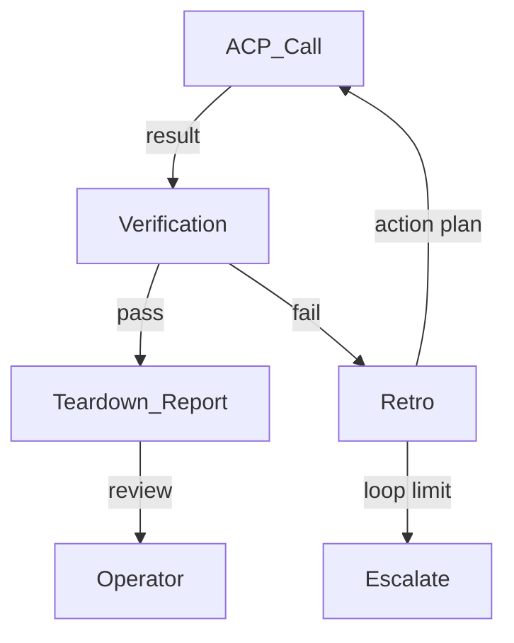

# Automation and Verification

## Goal / Objective

Apply the INITIATIVE-022 automated verification loop pattern to ACP harness calls. After an ACP call executes, verification design runs against the current intent snapshot — not the original plan. Failure triggers a retro, then loops back. The operator reviews at teardown, not during execution.

## Scope

- Two-phase execution: ACP call (implementation), then verification
- Verification design uses fresh intent snapshot (current artifact state)
- Discovery of existing tests covering what changed
- Writing new tests for gaps
- Automated loop: failure → retro → re-execute → verify
- Loop limit (5 cycles default) before escalation
- Reconciliation spectrum: small gap (add ticket), medium (update artifact), large (escalate)
- Teardown report: agent decisions, verification history, test design, results

## Architecture Overview

## Child Specs

- [SPEC-005](../../spec/Active/(SPEC-005)-Verification-Loop/(SPEC-005)-Verification-Loop.md) — Verification Loop
- [SPEC-007](../../spec/Active/(SPEC-007)-Configuration-and-Auth/(SPEC-007)-Configuration-and-Auth.md) — Configuration and Auth

## Lifecycle

| Phase | Date | Commit | Notes |
|-------|------|--------|-------|
| Active | 2026-04-19 | -- | Initial creation |