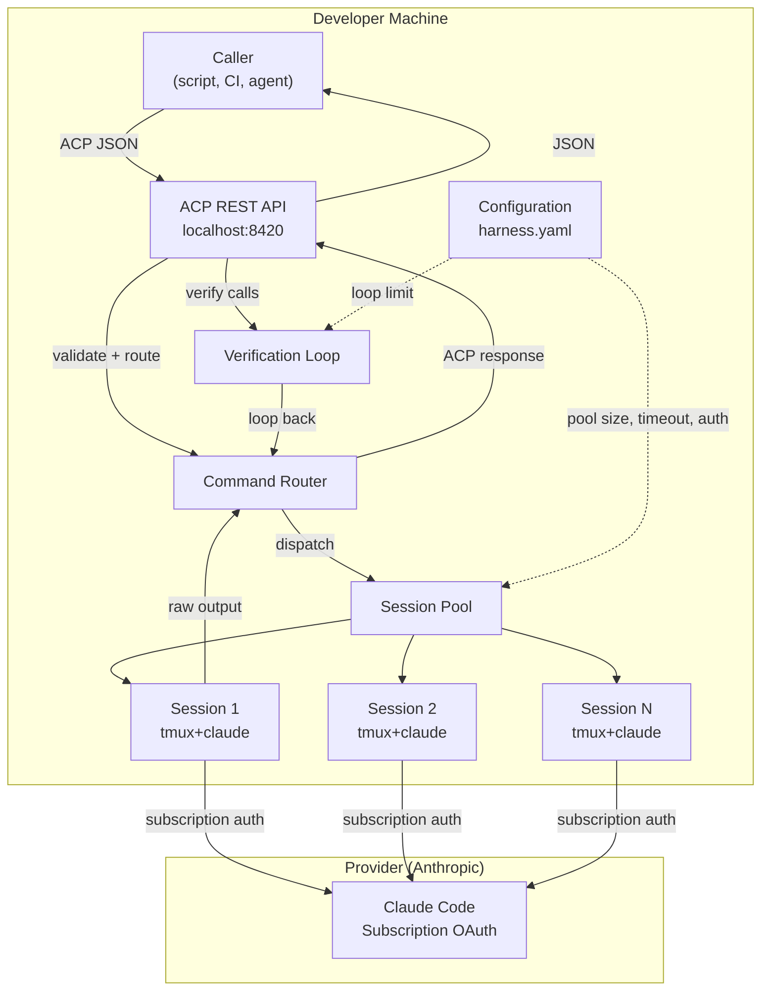

# Subscription ACP Harness — Architecture Overview

## System Context

## Component Responsibilities

| Component | Responsibility |
|-----------|---------------|
| ACP REST API | HTTP surface, schema validation, request routing |
| Command Router | Queue, dispatch, output capture, timeout/retry |
| Session Pool | Lifecycle management, health checking, rotation |
| Verification Loop | Post-call verification, retro, loop-back, teardown |
| Configuration | Auth method, provider settings, pool parameters |

## Data Flow

1. Caller sends `POST /acp/call` with ACP request
2. API validates schema, passes to Command Router
3. Router selects an `Idle` session from the pool
4. Router injects sentinel-wrapped payload via `tmux send-keys`
5. Router polls `tmux capture-pane` until end sentinel detected
6. Router parses output, constructs ACP response
7. API returns response to caller
8. If `type: verify`, Verification Loop wraps steps 2-7 with retro and loop-back